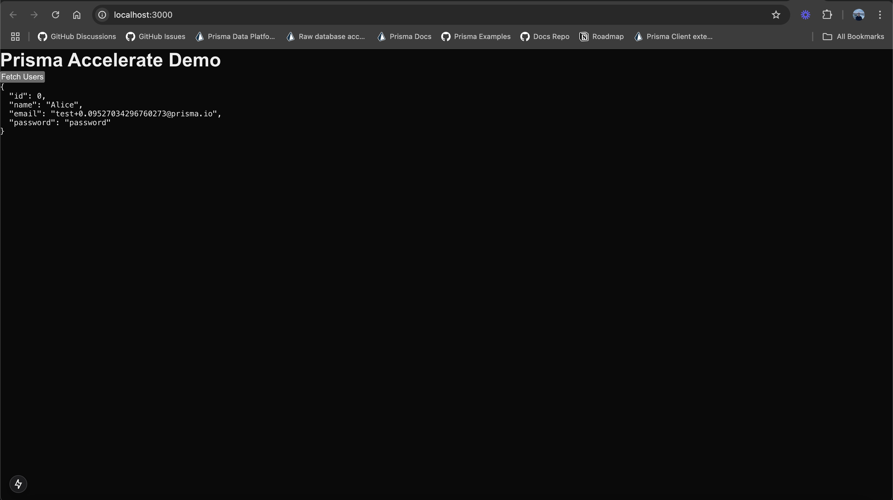
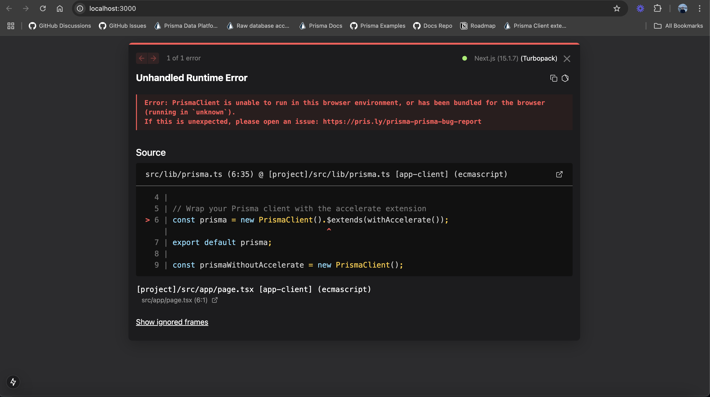

## Instructions

1. Clone this repository and install dependencies.
2. In your `.env` file set value of `DIRECT_URL` and `DATABASE_URL`.
3. Run `npx prisma db push` to create user table in your database and add some records.
4. Run `npm run dev` to start the server.
5. Clicking on "Fetch Users" button will fetch users from the database and display them on the page as expected.

## Notes

- As you can see, the app works as expected even though PrismaClient is imported in client component in `page.tsx` file

```
import prisma from "../lib/prisma";
import { prismaWithoutAccelerate } from "../lib/prisma";
```



If you uncomment this line you will get the PrismaClient cannot be used in browser error as expected.

```
//console.log(prisma, prismaWithoutAccelerate);
```



So, the issue occurs only if PrismaClient is used in the client side component, just importing it doesn't cause any issue.
